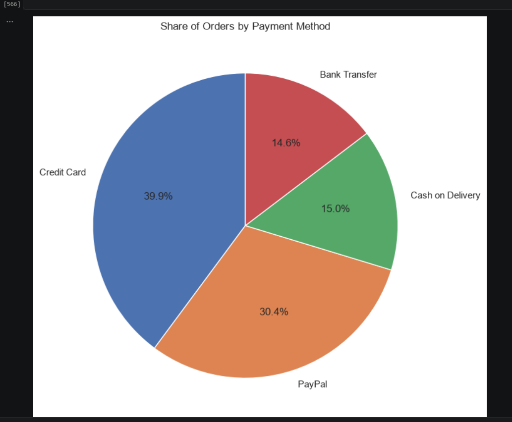
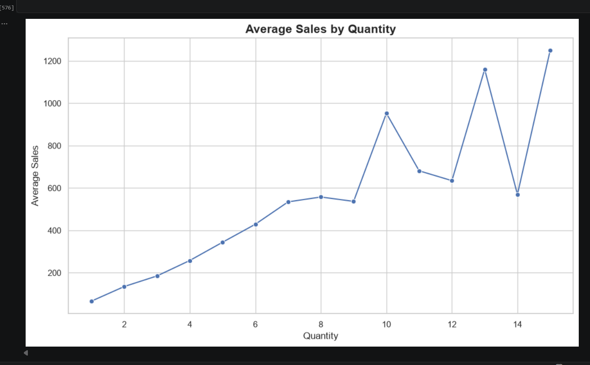
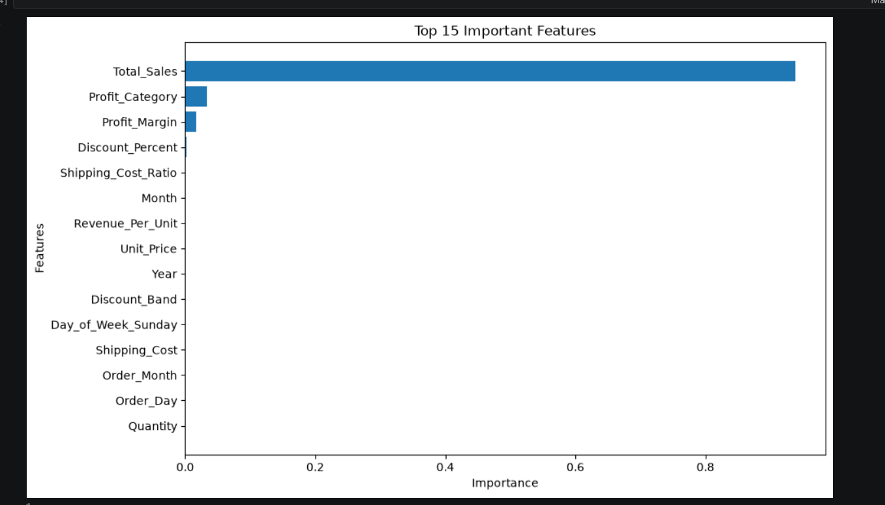
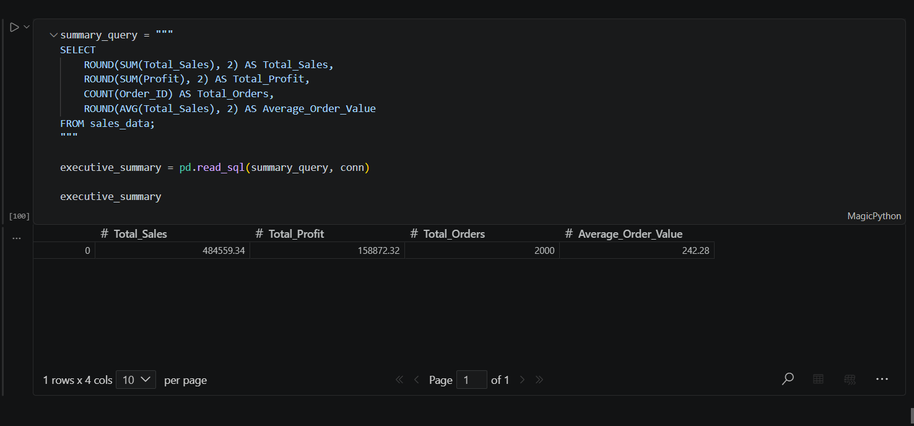

# 📊 Bharat Bazaar Intelligence Platform

An end-to-end Data Analytics project that analyzes global e-commerce sales data using Python, SQL, Machine Learning, and Streamlit to generate business insights through an interactive dashboard.

---

## 🌐 Live Demo

🔗 https://bharat-bazaar-intelligence.streamlit.app

---

## 💻 GitHub Repository

🔗 https://github.com/jaspreetkaur-stack/Project_6_Bharat_Bazaar_Intelligence_Platform

---

# 📖 Project Overview

Bharat Bazaar Intelligence Platform is a real-world end-to-end Data Analytics project built to analyze global e-commerce sales data. The project covers the complete analytics lifecycle—from data collection and preprocessing to SQL analysis, machine learning, interactive dashboard development, and business recommendations.

The dashboard enables users to monitor sales performance, profits, customer segments, product categories, payment methods, and business trends through interactive visualizations.

---

# 🎯 Objectives

- Analyze sales performance across countries and regions.
- Identify top-performing products and categories.
- Discover customer purchasing behavior.
- Perform SQL-based business analysis.
- Build a Machine Learning prediction model.
- Create an interactive Streamlit dashboard.
- Generate actionable business insights.

---

# 🚀 Features

- ✅ Data Cleaning & Preprocessing
- ✅ Exploratory Data Analysis (EDA)
- ✅ SQL Business Analysis
- ✅ Machine Learning Model
- ✅ Interactive Streamlit Dashboard
- ✅ KPI Cards
- ✅ Dynamic Filters
- ✅ Business Insights & Recommendations
- ✅ CSV Download
- ✅ Live Cloud Deployment

---

# 🛠 Tech Stack

- Python
- Pandas
- NumPy
- SQL (SQLite)
- Scikit-learn
- Plotly
- Streamlit
- OpenPyXL
- Git & GitHub

---

# 📂 Project Structure

```
Project_6_Bharat_Bazaar_Intelligence_Platform
│
├── app.py
├── requirements.txt
├── README.md
├── .gitignore
│
├── data
│   ├── raw
│   ├── cleaned
│   └── processed
│
├── notebooks
│   ├── 01_Data_Understanding.ipynb
│   ├── 02_Data_Cleaning.ipynb
│   ├── 03_SQL_Analysis.ipynb
│   ├── 04_Exploratory_Data_Analysis.ipynb
│   ├── 05_Feature_Engineering.ipynb
│   ├── 06_Machine_Learning.ipynb
│   ├── 07_Business_Insights_Recommendations.ipynb
│   └── 08_Interactive_Dashboard.ipynb
│
├── models
│   ├── best_random_forest_model.pkl
│   └── standard_scaler.pkl
│
├── sql
│   └── bharat_bazaar.db
│
├── screenshots
│   ├── dashboard.png
│   ├── EDA1.png
│   ├── EDA2.png
│   ├── ml.png
│   └── SQL_Analysis.png
│
└── docs
    ├── Business_Insights.md
    └── Project_Summary.md
```

---

# 📈 Workflow

1. Data Collection
2. Data Cleaning & Preprocessing
3. Exploratory Data Analysis (EDA)
4. SQL Business Analysis
5. Feature Engineering
6. Machine Learning Model
7. Interactive Streamlit Dashboard
8. Business Insights & Recommendations
9. Live Deployment on Streamlit Cloud

---

# 📊 Dashboard Preview

## 🏠 Home Dashboard


---

## 📈 Exploratory Data Analysis





---

## 🤖 Machine Learning



---

## 🗄 SQL Analysis



---

# 💡 Business Insights

- Technology category generated the highest revenue.
- Corporate customers contributed significantly to profit.
- Credit Card and PayPal were the most preferred payment methods.
- North America generated the highest sales.
- Business recommendations help improve profitability and inventory planning.

---

# 🔮 Future Improvements

- AI-powered Business Assistant
- PDF Report Generation
- Email Reporting
- Forecast Dashboard
- Advanced Machine Learning Models
- User Authentication
- Database Integration (MySQL/PostgreSQL)

---

# 👩‍💻 Author

**Jaspreet Kaur**

🎓 Data Analytics Enthusiast

📧 jaspreetbanwait1313@gmail.com

💻 GitHub

https://github.com/jaspreetkaur-stack

---

# ⭐ If you found this project useful, don't forget to Star this repository!
